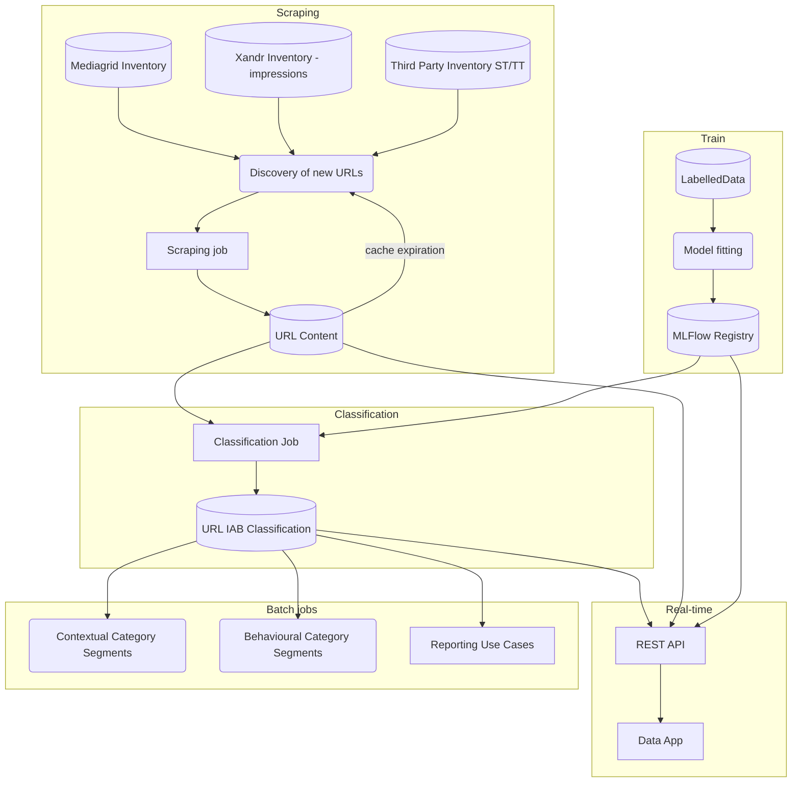

This evergreen note will document a plan to deliver a IAB classification of URLs and domains at volume.

There are three distinct compulsory problems, and a fourth, optional one:

1. Training an NLP model capable of classifying IAB URLs.
2. Retrieving the contents of large quantities of URLs, aka __The Scraping Problem__
3. Using the NLP model to classify URL contents.
4. Serving the model in real-time for people to be able to interact with it.

## Architecture outline

## Our Proposed Solution
### TL; DR
1. We will produce an **[[IAB classification]] URL dataset**, and make it available to the rest of the organization. This dataset will exist in the following ways:
    - As a metastore table
    - As a warehouse database table
    - (Optionally) As a key-value database
2. The main jobs reading from this dataset will be, by order of importance to the business:
    - **Contextual Category Segments**
    - Reporting Use Cases
    - Behavioural Category Segments
    - As a real-time Data App
3. The main obstacles in establishing this dataset are the following:
    - Selecting a number of URLs to be scraped on a regular basis: we propose to use a Data Pipeline
    - Scraping a volume of URLs on a regular basis: we propose to use a combination of queues and AWS Lambdas.
    - How to store scraped URL cleaned contents: we propose to use a key-value database (redis)
    - Training an NLP classifier capable of relating clean-text contents to an IAB classification.
    - Storing and serving a trained classifier: we propose to use the Databricks MLflow Registry
    - Classifying URLs / domains: a Spark job
    - How to store labelled URLs / domains: a key-value store together with copies of the data as metastore / warehouse tables.

### URL IAB Classification
The main goal of the Data Product is to produce a **dataset** of [[IAB classification]] labels for URLs and/or domains, and to make it available to the rest of our organisation.

The actual jobs and/or services that need to connect to this dataset will determine which is the right **source of truth** and which copies of the dataset need to be stored.

In case we need real-time interaction:
- **Source of truth**: a key-value metastore (_redis_, _dynamodb_)
- A dataset stored in our datalake and / or accessible from our AWS Glue Metastore
- A copy of the data as a Redshift Computing table (particularly if we )

Depending on which jobs and/or services need to be connected to this dataset, the 
This dataset could either be published as a database / metastore table containing `url, iab_label` as columns, or as a key-value database for faster access (ideally, there should be _model versioning_ and _cache expiration_).

### Main outputs

#### Contextual Category Segments
Haha
#### Reporting use cases

#### Behavioural Category Segments

#### Real-time Data App