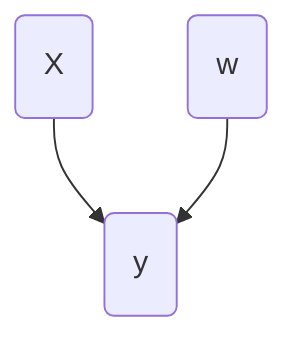

__Bayesian Linear Regression__ is the approach to linear regression from a [[Bayesian]] point of view.

The problem is exactly the same: we want to study the regression problem of predicting a target $y$ from a set of features $X$ by fitting a linear function that minimizes the errors.

Hence, the equation is, as usual,
$$
y = wX + b
$$
with weights $w$ and bias $b$. Given a sample $\left\{ (x_i, y_i) \right\}_{i = 1, \ldots, N}$, we want to minimize the least squares problem, that is: find the minimum of the following [[Loss Function]]:
$$
L(w) = \sum_{i = 1}^N (w^t x_i - y_i)^2 = \| w^t X - y \|^2
$$

So we compute $\hat{w} = \mathrm{arg min}_w L(w)$.

The [[Bayesian Network]] that describes this model is the following:

The data X is however not to be modelled, as it is a given. Hence, the model is described by:
$$
p(w, y \vert X) = p(y \vert X, w)p(w)
$$

## When distributions are normal

Assume that the posterior follows a multivariate normal distribution with diagonal covariance matrix, so that:
$$
p(y \vert w, X) = \mathcal{N}(w^tX, \sigma^2 I).
$$
Similarly, assume
$$
p(w) = \mathcal{N}(0, \gamma^2 I).
$$

From here we need to find the weights $w$ that maximize
$$
p(w \vert y, X) = \frac{p(y, w \vert X)}{p(y \vert X)}.
$$
Since only the numerator depends on $w$, we may disregard the denominator. Now,
$$
p(y, w \vert X) = p(y \vert X, w) p(w).
$$
Next, we take logarithms; the maximum is preserved:
$$
\log p(y, w \vert X) = \log p(y \vert X, w) + \log p(w).
$$

Finally, we use the assumption that the distributions are normal:
$$
\log p(y \vert X, w) + \log p(w)
$$
$$
= \log C_1 \exp(-\frac{1}{2}(y - w^tX)^t (\sigma^2I)^{-1}) (y - w^tX)) + \log C_2 \exp(-\frac{1}{2}w(\gamma^2I)^{-1}) w^t)
$$
$$
= - \frac{1}{2} (\frac{1}{\gamma^2} \| w \|^2 + \frac{1}{\sigma^2} \| y - w^tX \|^2) + C_3
$$
for some constants $C_1, C_2$ and $C_3$.

In conclusion, we need to minimize the expression:
$$
\lambda \| w \|^2 + \| y - w^tX \|^2,
$$
which is equivalent to solving the least squares problem with L2-regularization.

## When distributions are Laplace

The only thing that changes from the above reasoning if
$$
p(w) = \frac{1}{(2b)^n} \prod_{i=1}^n \exp(-\frac{|w_i|}{b})
$$
is that we end with an L1-regularization.