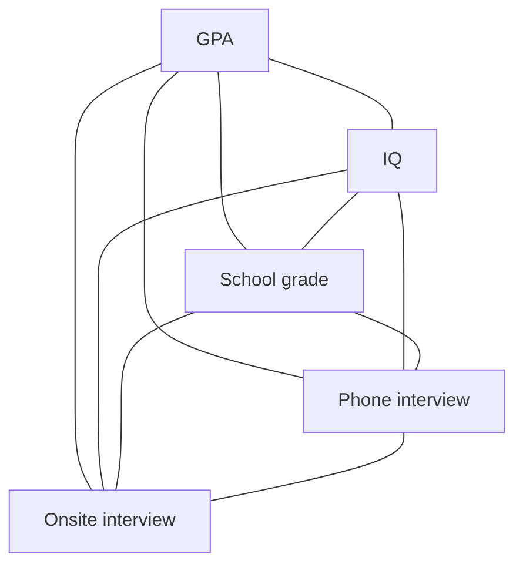

A __Latent Variable__ in [[Bayesian]] statistics is a variable that is not directly observable, but rather inferred from other observable variables through a model.

One of the main uses of latent variables is at reducing the dimensionality of data.

It may be said that often a latent variable need not be quantifiable: it is enough to be able to use it for reasoning about a model.

### Example

We want to hire candidates for a position and we have some data about their performance at school, IQ score, and a phone interview. We want to model this data in order to decide which candidates are better suited for an onsite interview.

Without a latent variable, the model looks as follows, with all nodes interconnected:


 
 We can decide that all five of these features are the consequence of a latent variable that we could call _intelligence_. With this, the model changes:
 
 ```mermaid
graph TD
  F[Intelligence] --> A[GPA]
  F --> B[IQ]
  F --> C[School grade]
  F --> D[Phone interview]
  F --> E[Onsite interview]
```