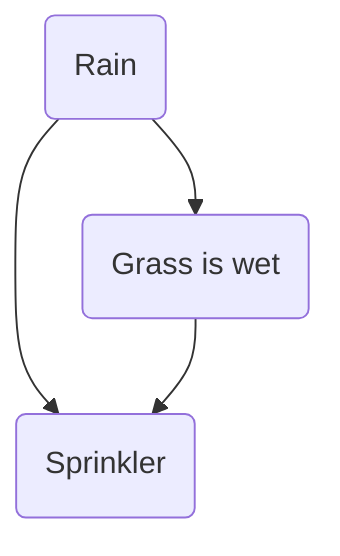

A __Bayesian Network__ is a [[DAG]] that represents a set of random variables and their conditional dependencies.

Nodes are random variables and edges represent direct impact. Example:

The relationships encoded in this graph are the following:
- If it rains, the sprinkler does not switch on.
- If it rains, the grass gets wet.
- If the sprinkler is on, the grass gets wet.

By looking at the DAG, we can write the model. By model, here, we mean the joint probability over all variables:
$$
p(X_1, \ldots, X_m) = \prod_{k = 1}^n p(X_k \vert \mathrm{Pa}(X_k)),
$$
where $\mathrm{Pa}(X_k)$ denotes the set of all parent nodes of $X_k$ in the DAG.

Coming back to the previous example DAG, and denoting each node by $S, R$ and $G$:
$$
p(S, R, G) = p(G \vert S, R) p(S \vert R) p(R)
$$

Another very good example of this is the [[Naive Bayes]] classifier.

