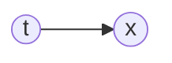

In [[Bayesian]] statistics, a __Mixture Model__ is a type of probabilistic model which represents the presence of subpopulations within an overall population. 

A __Gaussian Mixture Model__ is a type of [[Bayesian]] model which is expressed as the sum of a finite number of Gaussian distributions.

One of their main uses is [[Probabilistic Clustering]], by assuming that each of the clusters is sampled from one of the summands in the mixture model.

Imagine that we have three clusters. Then,
$$
p(x \mid \theta) = \sum_{i = 1}^3 \pi_i \mathcal{N}(x \mid \mu_i, \Sigma_i),
$$
with $\theta = \{ \pi_1, \mu_i, \Sigma_i \}_{i = 1, 2, 3}$.

If the problem is multidimensional, then the covariance matrices $\Sigma_i$, which are positive definite, bring a lot of parameters into the picture; a common simplification is to use a diagonal matrix (the axes of the ellipses describing the Gaussian are orthogonal to the coordinate axes) or even a multiple of the identity.

In order to train a GMM, we want to find:
$$
\max_\theta p(X \mid \theta)
$$

In [[ML|Machine Learning]], we usually make the common assumption that the training data is given by a $N$ points which are independent from each other. Hence the likelihood factorizers and we compute
$$
\max_\theta \prod_{i=1}^N p(x_i \mid \theta),
$$
which is then equal to
$$
\max_\theta = \prod_{i = 1}^N \sum_{j = 1}^3 \pi_j \mathcal{N}(x_i \mid \mu_j, \Sigma_j),
$$
subject to $\pi_1 + \pi_2 + \pi_3 = 1$, $\pi_j \geq 0$, $j = 1, 2, 3$, and the fact that the covariance matrices are positive definite.

This problem is tractable by stocastic optimization, such as [[Adam]] for example.

### Training a GMM

By adding a [[Latent Variable]], we make the assumption that the data has been generated by a common procedure:

(this implies causation).

This in particular means that it is reasonable to assume that the latent variable $t$ has prior distribution $\pi$. In other words, it describes the weights of each normal: for a cluster $c \in \{1, 2, 3\}$,
$$
p(t = c \mid \theta) = \pi_c
$$

Under this updated model, now we have
$$
p(x \mid t=c, \theta) = \mathcal{N}(x \mid \mu_c, \Sigma_c)
$$

By the rule of sum for probabilities, we have:
$$
p(x \mid \theta) = \sum_{c=1}^3 p(x \mid t = c, \theta) p(t=c \mid \theta),
$$
so we recover the original description of the probability.

### Expectation maximization

On one hand, we need Gaussian parameters to estimate sources and, on the other hand, we need sources to estimate the Gaussian parameters.

So, an idea to compute the above is to initialize parameters at random and then update them to fit the points assigned to them until convergence.

This is much faster than [[Stochastic Gradient Descent]], but it suffers from local maxima.
