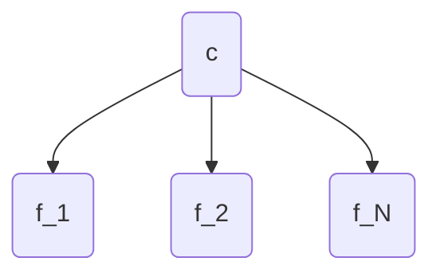

The __Naive Bayes classifier__ is the classification model expressed by the [[Bayesian Network]] where a class $c$ directly impacts the values of the features $f_1, \ldots, f_N$.

It is called _naive_ because of this model assumes that all features are pair-wise independent, an assumption that is almost never true.

The probability for this model is
$$
p(c, f_1, \ldots, f_N) = p(c) \prod_{i = 1}^N p(f_i \vert c)
$$