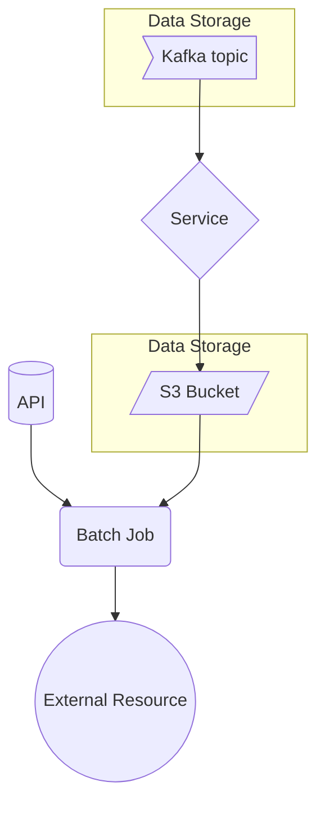
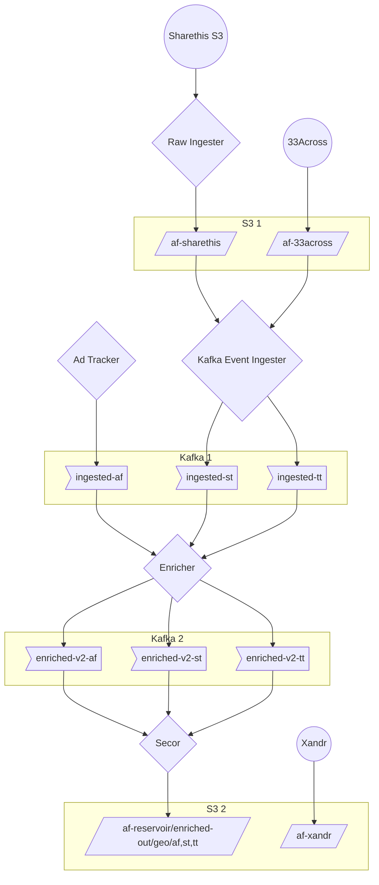
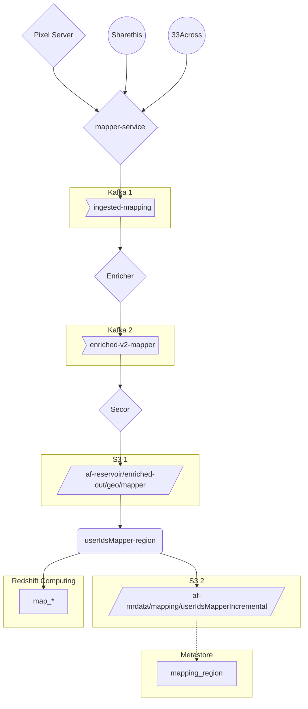
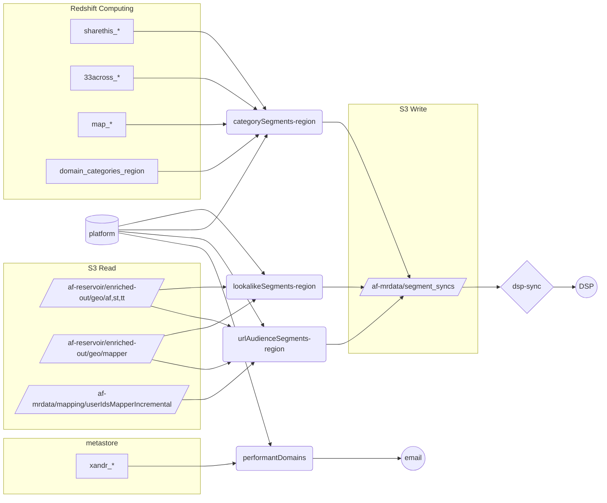
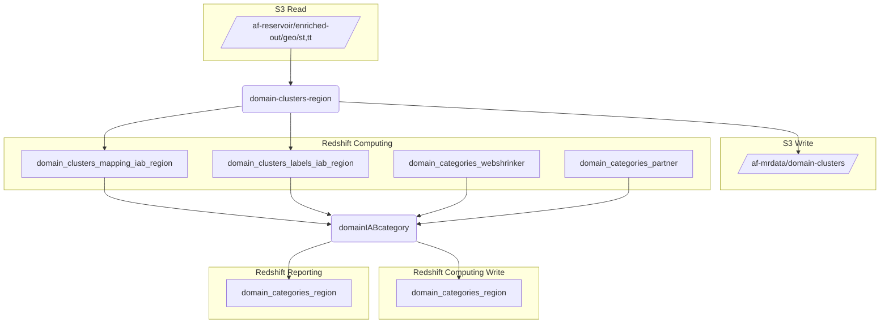
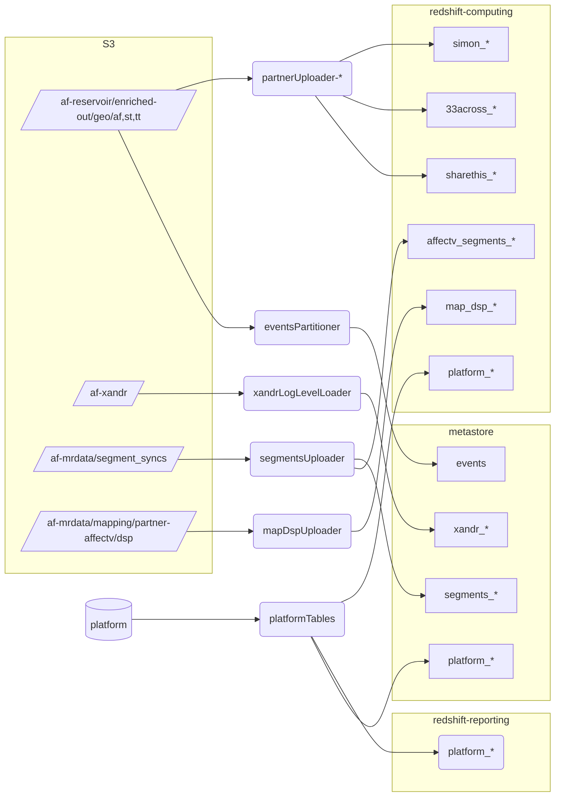
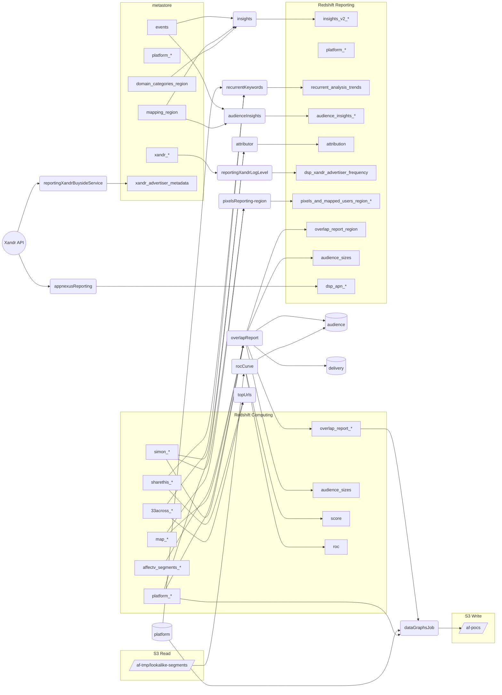
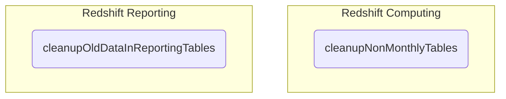

# Data flow

# Legend

Governing rule: a data job can only appear in a single domain.

# Web browsing events ingestion

# Cookie mapping

Cookie mapping is the procedure that allows us to build an identity graph capable of syncing cookie IDs from different providers (ourselves, DSPs, third-party data providers).

The responsibility of this domain is to make mapping data available. Mapping datasets are vital as they allow the reconstruction of a user's browsing history across different data providers.

Results datasets:

- `s3://af-mrdata/mapping/userIdsMapperIncremental/`, in parquet. This is loaded "as is" into the AWS Glue Metastore.
- Redshift computing mapping tables: they are partitioned by partner and region under `map_*`.

Problem:

- The `userIdsMapper` job has two responsibilities that we could separate by creating a new Reporting Enablement job:
  - Compute the connected components in the identity graph.
  - To enable reporting by uploading results to Redshift Computing and the Metastore.

# Segment building

Segment building is the Data Domain that is responsible for producing data that can be pushed to our DSP(s) for the purpose of enabling the orchestration of online marketing campaigns.

The Data Products built by the jobs in this domain may be classified as follows:

- __User segments__. These are lists of cookie IDs.
- __Contextual segments__. These are lists of URLs or site domains.

Open problems:

- `performantDomains` should not read from the AWS Glue Metastore
- `categorySegments` should not be computed on Redshift Computing

# Domain classification

This is a domain containing a single Data Product. Its responsibility is to serve a _model_ that enables relating a website domain to its IAB category.

Open problems:

- Add final result to the AWS Glue Metastore reliably

# Reporting enablement

Data products in this domain have the responsibility of loading data into our Data Warehouse/Lake in formats which:

- May be manipulated at speed
- Are respectful of Data Protection regulations

# Reporting

This domain is responsible for producing aggregated data in a fashion which may be consumed by:

- __PowerBI__ and other dashboards
- Our internal APIs
- Sent emails

Problems:
- `rocCurve` should not write to RDS.

# Maintenance

Jobs here are responsible for deleting old data from Database tables, to ensure that storage is kept at reasonable usage

