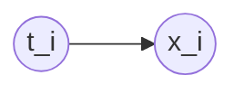

The __Expectation Maximization__ algorithm is a method for training [[Latent Variable]] [[Bayesian]] models. 

One of its features is that it allows to fill in for missing training data in probabilistic terms.

### Formulation

In the setting of the model described in [[GMM|Gaussian Mixture $Model]], given a [[Latent Variable]] model

the likelihood decomposes as follows:
$$
p(x_i \vert \theta) = \sum_{c=1}^3 p(x_i \vert t_i = c, \theta) p(t_i = c \vert \theta)
$$

The problem is to maximize the likelihood
$$
\max_\theta p(X \vert \theta).
$$

By taking the logarithm and assuming that the dataset $X$ is a set of values ${x_i}_{i=1\ldots N}$ which are independent observations, the above is equal to
$$
\max_\theta \log \prod_{i = 1}^N p(x_i \vert \theta) = \max_\theta \sum_{i = 1}^N \log \sum_{c=1}^3 p(x_i, t_i = c \vert \theta).
$$
The right hand-side admits a lower bound by using [[Jensen's inequality]]. However, before proceeding, we will multiply and divide by putting a distribution $q$ on $t$; the corresponding weights appear as weights in [[Jensen's inequality]]:
$$
\log p(X \vert \theta) = \sum_{i = 1}^N \log \sum_{c=1}^3 \frac{q(t_i = c)}{q(t_i = c)} p(x_i, t_i = c \vert \theta) \geq \sum_{i = 1}^N \sum_{c = 1}^3 q(t_i = c) \log \frac{p(x_i, t_i = c \vert \theta)}{q(t_i = c)} = \mathcal{L}(\theta, q).
$$

The inequality holds for any $q$, and by varying it we can obtain a family of lower bounds.

We can use an iterative approach:
1. Choose a value $\theta^k$.
2. Find a $q^{k+1}$ that maximizes $\mathcal{L}(\theta, q^{k+1})$.

### E-step

The E-step, or expectation step, fixes $\theta^k$ and attempts to find
$$
\max_q \mathcal{L}(\theta^k, q).
$$
In other words, we want to minimize the gap $G$ between the log-likelihood and the lower bound. We have that
$$
\begin{eqnarray}
G &=& \log p(X \vert \theta) - \mathcal{L}(\theta, q) \\
&=& \sum_{i=1}^N \log p(x_i \vert \theta) - \sum_{i=1}^N \sum_{c=1}^3 q(t_i = c) \log \frac{p(x_i, t_i = c \vert \theta)}{q(t_i = c)} \\
&=& \sum_{i = 1}^N \left( \log p(x_i \vert \theta) \sum_{c=1}^3 q(t_i = c) - \sum_{c=1}^3 q(t_i = c) \log \frac{p(x_i, t_i = c \vert \theta)}{q(t_i = c)} \right) \\
&=& \sum_{i = 1}^N \sum_{c=1}^3 q(t_i = c) \left( \log p(x_i \vert \theta) - \log \frac{p(x_i, t_i = c \vert \theta)}{q(t_i = c)} \right) \\
&=& \sum_{i = 1}^N \sum_{c=1}^3 q(t_i = c) \log \frac{p(x_i \vert \theta) q(t_i = c)}{p(x_i, t_i = c \vert \theta)} \\
&=& \sum_{i = 1}^N \sum_{c=1}^3 q(t_i = c) \log \frac{q(t_i = c)}{p(t_i = c \vert x_i, \theta)} \\
&=& \sum_{i=1}^N \mathrm{KL}(q(t_i) \Vert p(t_i \vert x_i, \theta)).
\end{eqnarray} 
$$

So, in summary, $G$ is given exactly by the [[Kullback-Leibler divergence]] between $q(t_i)$ and $p(t_i \vert x_i, \theta)$.

Remarks:
- In the third line, we use the fact that $q$ is a distribution, so it sums up to one: $\sum_{c=1}^3 q(t_i = c) = 1$.
- In the sixth line, we apply Bayes' rule: $p(x_i, t_i = c \vert \theta) = p(t_i = c \vert x_i, \theta) p(x_i \vert \theta)$.

Minimizing $G$ is therefore equal to minimizing the [[Kullback-Leibler divergence]] above. By the properties of the divergence, this minimum is $0$ and obtained precisely when the two distributions coincide. Hence, we need to choose:
$$
q(t_i) = p(t_i \vert x_i, \theta).
$$

### M-step

The M-step, or maximization step, consists of maximizing the lower bound $\mathcal{L}(\theta, q)$ with respect to $\theta$, having fixed $q$. We have that
$$
\begin{eqnarray}
\mathcal{L}(\theta, q) &=& \sum_i \sum_c q(t_i = c) \log \frac{p(x_i, t_i = c \vert \theta)}{q(t_i = c)} \\
&=& \sum_i \sum_c q(t_i = c) \log p(x_i, t_i = c \vert \theta) - \sum_i \sum_c q(t_i = c) \log q(t_i = c).
\end{eqnarray}
$$
Since the second summand in the expression is constant with respect to $\theta$, we need only focus on the first. The first term is an expected value, so we can simplify:
$$
\mathcal{L}(\theta, q) = \mathbb{E}_q \log p(X, T \vert \theta) + c
$$
for some constant $c$.

The expectation function is usually concave. By this we mean that normally one chooses $p(X \vert T)$ and $P(T)$ in such a way that the log-likelihood is concave. We will assume this to be the case henceforth.

__Remark__. In the case of the [[GMM]], $p(X, T \vert \theta)$ is Gaussian. The logarithm of a Gaussian is a parabola, which is concave.

### Summary

Iterating on $k = 1, 2, \ldots$:

- E-step computes
$$ q^{k+1}(t_i) = p(t_i \vert x_i, \theta^k). $$
- M-step computes
$$ \theta^{k + 1} = \arg \max_\theta \mathbb{E}_{q^{k+1}} \log p(X, T \vert \theta). $$

### Convergence guaranties

We have that, by construction,
$$
\log p(X \vert \theta^{k+1}) \geq \mathcal{L}(\theta^{k+1}, q^{k+1}) \geq \mathcal{L}(\theta^k, q^{k+1}) = \log p(X \vert \theta^k).
$$

So on each iteration the objective does not decrease and we are guaranteed to converge to a local maximum (or saddle point).

__Remark__. Observing a decreasing objective metric during training is a very good debugging hint.