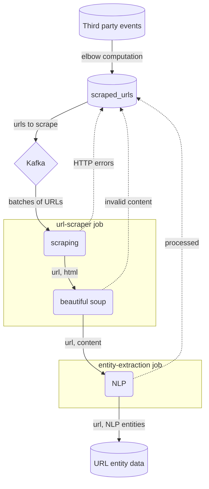

The __Scraper__ is the [[HT]] POC and, later, product, capable of scraping a given amount of URLs in parallel and extracting [[NLP]] entities from the associated documents.

## Workflow

### Selection of URLs to scrape

URLs are sorted according to the number of unique users having visited them in a 7-day lookback window.

Using an elbow technique, a maximum of 7M URLs, ranked by descending number of users, are selected and saved in a table. 

This step uses [[SparkSQL]] on [[Databricks]].

### URL queueing

A second task is charged with sending the URLs to be looked up to a queue. This ensures that parallelization is done properly, as subsequent parallel instances retrieve URLs from the same queue.

This step uses our existing [[Kafka]] infrastructure.

### Scraping job

Each instance of this job retrieves a batch of URLs from [[Kafka]].

In a first step, the URLs are scraped, using a precise combinanion of [[asynchronous]] and [[multiprocessing]] techniques.

In a second step, we parse URL contents using the [[Beautiful Soup]] library.

At the end of this procedure, a [[parquet]] file is saved to a shared disk volume containing URLs and the plain text contents.

This step is a [[Python]] script that is parallelized using [[Docker]], running on a [[Kubernetes]] cluster. Data is saved to a shared [[EBS]] volume.

### Entity extraction job

Each instance of this job grabs one of the parquet files from the previous step and processes URL contents in order to extract keywords.

Currently, only [[Gensim]]'s implementation of the [[TextRank]] algorithm is used, although experiments have been run to compute [[RAKE]] and to perform [[NER]] using the implementations available in the [[SpaCy]] and [[Stanza]] libraries.

The obtained list of keywords is then stored in a [[Databricks]] table.

## Data flow

