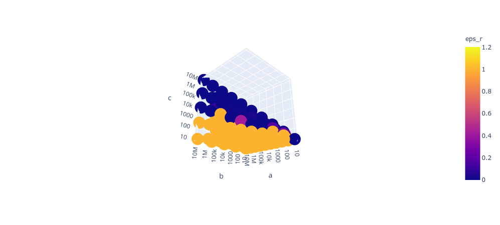

## Inference and error bounding

In order to study the behaviour of estimation errors when sampling, we have implemented the two models (one-sided and two-sided) using the PyMC3 library.

These parameters have been used as entry parameters for the aforementioned models.

We include visualizations from the results.

### One-sided results

In here we can observe that the relative error quickly decreases as the size of `c` increases. This is both due to the fact that the relative error is a decreasing function on the size of `c`, but also that as `c` increases the lihelihood of sampling elements in `C` also increases.

### Two-sided results

In here we observe that the relative error decreases as `c` increases but takes much longer to drop below an acceptable threshold. The behaviour is significantly worse than in the case of one-sided samples.

## Further questions

### What happens to the one-sided samples if we reduce sampling rates to `0.05` and `0.01`?

The relative error increases slightly but at a very slow rate. Hence, this could be a very good alternative when we are sampling from very large datasets.

### What happens to the two-sided samples if we increase `s_B` to `0.3`?

The relative error is still ill-behaved. This approach does not seem very promising.

### What happens to two-sided samples if we average over `10` samples at `0.1` rate?

The relative error drops. After all, this is due to the law of large numbers and is the main reason why Monte Carlo methods (averaging over repeated samples) are so effective.
However, the computational cost and code complexity would increase.