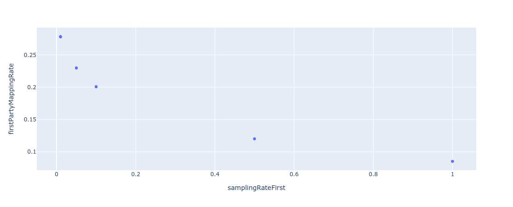
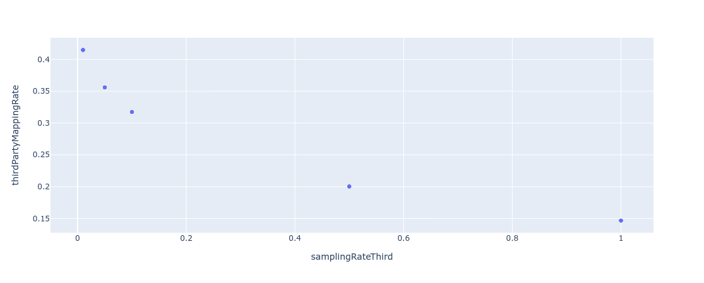
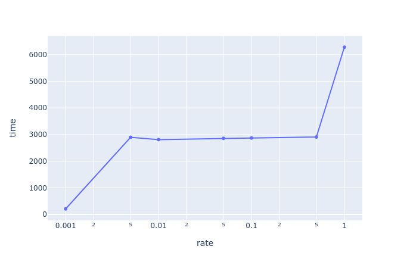

What happens to the [[Mapping Rate]] when we use [[Sampling]] on one of the two sides (or both)?

## TL;DR

Some key take-aways:

- The mapping rate is a decreasing function in the sampling rate. Ie: the more we sample, the better it becomes.
- Both sides (first-party and third-party) exhibit __independent__ behaviour. Sampling on either side affects the mapping rate on that side, but has no noticeable impact on the other.
- Because of the sampling method used, we only obtain a significant speed-up when the sampling rate is very small, below `0.005`.
- A possible cheap improvement of the aggregations is to replace the `count distinct` used in some of the insights aggregations by the `approx_count_distinct` functions available in [[Spark]].

## Sampling the mapping rate

We have performed the following experiment on mapping rates:
- Lookback: one day (2021-04-07), one week (2021-04-01 to 2021-04-07)
- Sampling rate: 0.01, 0.05, 0.1, 0.5, 1 (on both sides)
- Benchmark: 2 runs per value

Total: 100 runs

There are no big differences between one week and one day sampling.

The main surprise is that the more we sample, the better the mapping rate. Although this seems counterintuitive, the following might explain it: we are sampling on events (not lists of user ids) and there are a vast amount of user ids that only show once and are not mappable. When we sample, the probability of choosing an id increases linearly with the number of events that id appears on. Hence, as we sample, we are more likely to discard non-mappable ids.

Another fact that we had not hypothesized is that sampling on one side seems to have no noticeable effect on the mapping rate on the other side, as seen in the correlation matrix:

| samplingRateFirst | samplingRateThird | firstPartyMappingRate |  thirdPartyMappingRate |
|-----|-----|----|-----|
| 1 | -3.12e-17 | -0.90 | -0.004 |
| -3.12e-17 | 1 | 0.002 | -0.91 |
| -0.90 | 0.002 | 1 | 0.003 |
| -0.004 | -0.91 | 0.003 | 1 |

## How fast is sampling?

If we use `org.apache.spark.sql.DataFrame.sample`, this is quite slow unless executed on an already cached dataframe. Performance becomes significantly faster under very small sampling rates (below `0.1`).

For the experiments, we computed the tables of mappable events on either side, kept only the first-party and third-party ids and cached that.

By using left joins, we are able to recover non mappable events as those with null id on the other side.

It seems that `df.sample` parses through the whole dataset in order to decide which rows to keep.

It could pay to sample if the win is large on the other side. However, it would be even better to sample prior to looking over the whole dataset.

## How fast is the pullback?

We have run an experiment performing a pullback that would be equivalent to what is carried out as a first step in the insights reports. In other words, with a 7-day lookback (2021-04-01 to 2021-04-07):

- Select (and sample) first party data.
- Map to third party ids.
- Join on third party events.
- Write the pullback to S3 in parquet format.

We have performed two runs of this experiment for each of the following sample rates, and measured the elapsed time:

- 0.001, 0.005, 0.01, 0.05, 0.1, 0.5, 1.0.

The results are plotted below:

As seen, using the `df.sample` method in this setting reduces the time by about one half for any sampling rate between 0.01 and 0.5. To have a significant improvement, we need to drop to a rate below 0.005

## Notebooks

- One week sampling mapping rate. https://dbc-d63cbbe9-c447.cloud.databricks.com/#notebook/24235/command/24236
- Sampling pullback. https://dbc-d63cbbe9-c447.cloud.databricks.com/#notebook/24316/command/24317
- Results analysis. https://dbc-d63cbbe9-c447.cloud.databricks.com/#notebook/24602/command/24694

