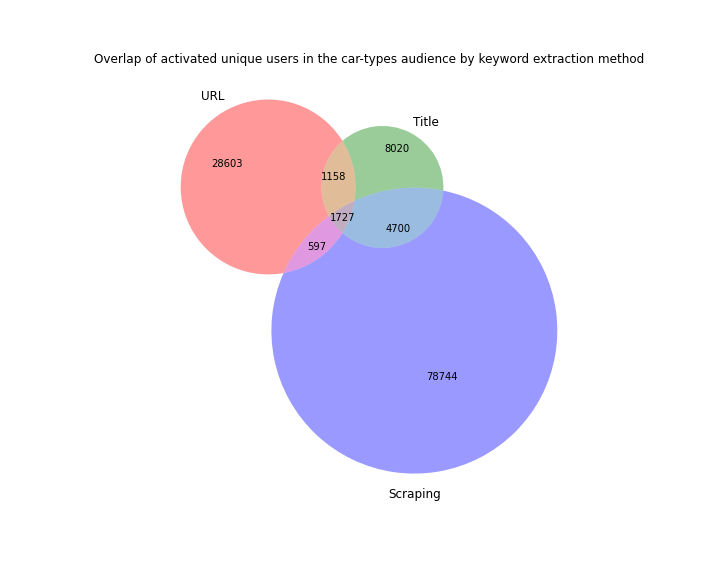
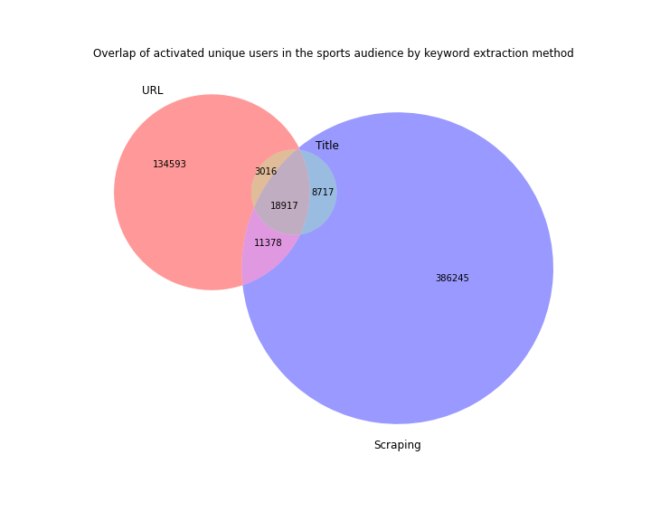

In this strand of work we describe how we have used Natural Language Processing together with web scraping at scale in order to improve the scale and quality of our campaign audiences.

## State of affairs

### Custom audiences

Keyword-based audiences are built by specifying a list of keywords and identifying users who have browsed on websites related to those keywords. They are a common method to deliver campaigns at scale in AdTech, since they allow the identification of segments of users having a behaviour that expresses a common interest.

At [[HT]], we acquire and process large volumes of data through our partners. We build keyword-based audiences using an in-house developed product, [[Custom Audiences]], which is available in our Ad trading [[Platform]].

In this way, traders can define an audience in the Platform by describing a list of keywords. The URLs of recent events are then processed in order to verify whether they contain any of the given keywords. Users having visited any of these URLs are then put in the segment, so that they may be targeted in a campaign.

We very often encounter URLs which do not contain enough information about the website contents. To give an example, consider the following URL:

```
https://www.bbc.com/news/world-europe-56675290
```

It is not possible to deduce that this website contains a piece of news about the auction of a Caravaggio painting solely by looking at the URL. Thus, we would miss the chance to add users visiting this website to an audience composed of art lovers.

The procedure we follow in order to relate URLs to keywords is a [[Tokenization]], which consists of breaking up the URL into individual words, and then discarding those which are obviously not useful because of their being extremely common (these words are referred to as [[Stopwords]]). In the case of the URL above, we would end up with a list such as:

```
bbc, news, world, europe
```

If we were to manually decide whether the given URL is relevant, we would access it, look at its contents and then make a decision about its inclusion in our list of valid URLs based on the topics appearing in the text.

## Problems and uncertainties

We wanted to research the enhancement of keyword extraction methods so that more URLs could be activated when constructing our audiences.

The approach outlined above, consisting in checking the contents of websites associated to URLs, may be automatized by using [[NLP]] (NLP) techniques. The steps to replicate the above procedure in an automated fashion would involve a script that:

1. Sends a request to the URL.
2. Extracts HTML code from the response body.
3. Cleans up the HTML code into a plain text document.
4. Processes the document using an NLP algorithm.

More generally, we set out to study further methods to associate a list of keywords to a given URL.

### Network transfer

The range of distinct URLs that we observe in a 24h period oscillates in the 70 million range. The main engineering problem to solve when working towards an automatized NLP solution is how to perform the URL lookups at scale for this volume.

Each URL lookup involves establishing an HTTP connection and, when performing lookups sequentially, the vast majority of CPU time is spent waiting for responses. As a matter of fact, this is a classic example of a problem which benefits enormously from [[parallelization]] (more precisely, [[concurrent]], [[asynchronous]] parallelization).

If we parallelize such a computation on a single machine, however, we will soon encounter another hurdle: the limit of outgoing connections is bounded. 

Therefore, it was necessary to find a clean approach to parallelizing the access to website contents.

### Header vs whole document

The website head matter contains, under the `<title>` header, a short title sentence which often can serve as a document summary.

Extracting that sentence prior to parsing the rest of the document could provide enough information to allow us to stop looking at the rest of the document.

Hence, this is was a possibility to explore.

### Document extraction

In order to obtain a plain text document from the HTML content coming from a website, we needed to parse the HTML code, clear away any HTML tags, decide which parts of the text would correspond to the visible text, and keep them.

### Keyword extraction

The procedure of extracting keywords from a given text document is a well-known [[NLP|NLP]] text summarization task. There are many open source implementations available in well-known, easily accessible libraries.

In this case, our problem was to validate the performance of these algorithms in regards to our particular problem.

### Other NLP techniques 

There are further [[NLP]] techniques that could have been applied in order to extract information of a better quality out of website contents. In particular:

- [[Sentiment Analysis]] methods could be used to detect whether a keyword features in a URL positively or negatively. This would allow us to discern between websites expressing favourable or contrary opinions about a given subject.

- [[NER]] methods could be applied to detect URLs related to specific people, places, etc.

We focused our efforts to the extraction of keywords.


### Existing available alternatives

There are companies that provide API services that, when sent a URL, respond with a list of associated keywords.

However, initial trials have shown that they fall under one of the following two categories:

 - The keywords have very little relationship with the actual contents of the website, hinting at a not-so-good [[NLP]] technique in place.
 - The price of using the service at scale is prohibitive.

For this reasons, we went into exploring an in-house alternative suited to our scale and quality needs.


## Advances and Progress Made

The consideration of the problems described above lead us to develop the proposal for a new product, called [[Scraper]].

The parts of the development of this product that we regard as R&D are the following:

- We conducted a [[POC|Proof of Concept]] that provided answers to many of the uncertainties detailed above.
- We designed an ad-hoc infrastructure in order to sort out the uncertainties related to scraping websites at scale.

### Scraper POC

The [[POC|Proof of Concept]] for the [[Scraper]] was centered around resolving as many of the challenges and uncertainties encountered, while staying within the limits of single-machine parallelization. In other words, the goal was to find a fast enough implementation of a methodology to:

1. Fetch and parse the contents of websites.
2. Extract keywords using [[NLP]] techniques.

We used [[Python]] as a programming language, due to the availability of several packaged libraries that could let us sort out obstacles with little effort.

Regarding the first matter, we had to dig deep into the available resources for [[Parallel Computation]] in [[Python]]. On one hand, we needed to use [[Multithreading]] in order to release the [[CPU]] while waiting for network responses. Recent versions of [[Python]], starting from 3.6 in 2016, include significant work in the [[asyncio]] library. As a matter of fact, it was necessary for us to use the newest features in version 3.8, which was the most recent release at the time. On the other hand, it was very challeging to extrapolate this approach to a [[Multiprocessing]] context, where the computation would span over several OS processes. The solution adopted, as a matter of fact, parallelizes on as many processes as CPUs available while each individual process spans into multiple threads.

We used the [[Beautiful Soup]] Python library to clean up the HTML code into a plain text document. This is possibly the most popular [[Python]] library for HTML and XML clean-up. Since we found no bottlenecks at this point, this turned out to be an excellent fit.

At this point we also found out that retrieving the website title takes as much effort as retrieving the whole of the contents. Therefore, we discarded the possibility of extracting keywords only from the title.

Regarding the second point, we took the following algorithms implemented in open source libraries into consideration:

- The [[TextRank]] implementation available in the [[Gensim]] library. This performs very efficiently and allows for the extraction of a list of keywords along with relevance scores.
- [[RAKE]] as implemented in the [[rake-nltk]] package.
- [[NER|Named Entity Recognition]] techniques. These allow for a more sophisticated approach than keywords, since they allow to detect entities such as particular people or places. However, the available implementations that we looked at, in the [[SpaCy]] and [[Stanza]] libraries, took both significant amount of resources by processing on a [[GPU]] while not offering significantly better results.

### Audience Quality

We conducted an experiment to compare how a given list of keywords could allow us to unlock URLs by looking up in their contents, beyond URL tokens, and add new, previously unseen users to the segment.

We computed the segments resulting from each strategy (keywords found in the URL vs keywords found in the title vs keywords found via scraping). Below, two examples of audiences from our experiment:





The conclusion is that using scraping would allow for a very significant increase in the size of our segments while keeping them relevant.

### Infrastructure solution

In order to resolve the problem of scraping URLs at scale, it was necessary to parallelize on multiple nodes while avoiding network problems.

For this reason, we designed an architecture that leverages [[Kubernetes]] as an orchestrator. Several types of computing nodes are used for the different computation steps, including [[GPU]]-enables [[NLP]] computations, while sharing data across nodes via [[EBS]] volumes.

We also used [[Databricks]] in order to compute and maintain tables of URLs to scrape and the extracted keywords from them, and we relied upon our existing [[Kafka]] infrastructure for URL queueing.


## Future work

The development of a production-quality scraper has been highly prioritized in our Product Roadmap. We dedicated efforts to this project during 2020 and into 2021.


