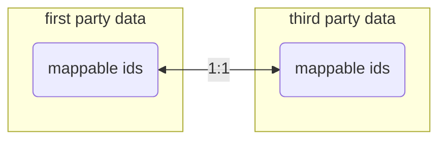
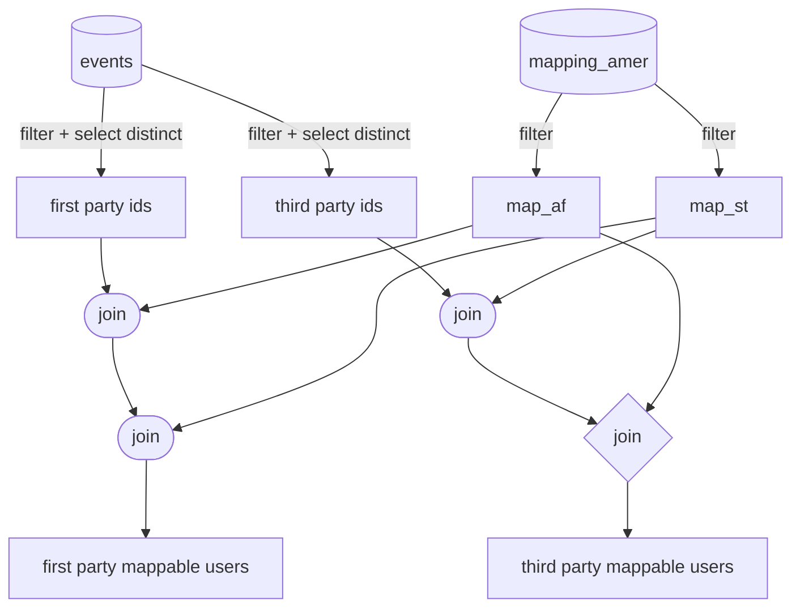

The __Mapping rate__ is the proportion of users that are observed  that can be mapped between [[first-party browsing data]] and [[third-party browsing data]] in the [[Mapper]].

This KPI measures how well we can expect to do in terms of relating users having visited an advertiser's website to their browsing behaviour. Among other things, it depends on:

- The [[Mapper#Batch scheduled component]] as a product which we control.
- The quality of the sites where [[third-party browsing data]] is collected by our partners ([[ShareThis]], [[33Across]]).
- The relevance of the advertiser and the amount of traffic it draws.

Real time metrics are available.

- There is a [[Grafana]] dashboard: [First and Third Party User Mapping](http://monitoring.affec.tv/d/RedkN1fmk/first-and-third-party-user-mapping?refresh=1h&orgId=1).
- The above dashboard contains a specific [First-Party PERCENTAGE MAPPED Users per Country](http://monitoring.affec.tv/d/RedkN1fmk/first-and-third-party-user-mapping?refresh=1h&panelId=9&fullscreen&orgId=1) visualization.

## Technical data flow 

From an abstract point of view, the [[Mapper]] gives us a one-to-one correspondence between subsets of first-party and third-party users.

Of course, this correspondence is slightly more involved because distinct first-party or third-party ids can correspond to the same user. 

If this is the case, then we would see several ids mapping to the same [[Mapper#Universal ID]]. For this reason, it is not exactly a problem of computing an intersection.

With the currently available data in [[Databricks]].

The join operations are not on unique indices and this motivates some duplication.

If we restrict ourselves to counting the proportion of first-party (resp. third-party) ids which are mappable to a third-party (resp. first-party) id, we will see different absolute numbers on either side.

The mapping rate is then computed as the ratio of two counts:

## Behaviour

Typically, we observe many more third party user ids than first party. So the most interesting metric is the ratio of first-party users that are mapped to a third party user.

However, there is also much more id duplication in [[third-party browsing data]].

For the US, the mapping rate oscillates in the 0.2 area.

The rate changes as we increase the lookback on the events that we are tracking. 

For example, for the [[AMER]] region, on the single day 2021-04-07, we observe:
- First party mapping rate: $0.0843$ ($N = 913045$)
- Third party mapping rate: $0.1455$ ($N = 11096547$)

If we go to a whole week, from 2021-04-01 to 2021-04-07:
- First party mapping rate: $0.0592$ ($N = 4286546$)
- Third party mapping rate: $0.0994$ ($N = 47834266$)

For a whole month, from 2021-03-01 to 2021-03-31
- First party mapping rate: $0.0592$ ($N = 4286546$)
- Third party mapping rate: $0.0994$ ($N = 47834266$)