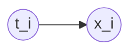

__Probabilistic Principal Component Analysis__ (__PPCA__), is a probabilistic approach to [[PCA]] built upon assuming that there is a [[Latent Variable]] which consists of the projection.

This is because the values in the target space after PCA are actually not observed, so they may be treated as a [[Latent Variable]].

The priors for these latent variables are set as normals centered at zero with identity variance matrix. Then the observed values are obtained from a linear transformation.

Given points $\{ x_i \}$, we want to find projections $t_i$. If we assume a prior
$$
p(t_i) = \mathcal{N}(0, I),
$$
we can then model
$$
x_i = W t_i + b + \varepsilon_i,\quad \varepsilon_i \sim \mathcal{N}(0, \Sigma).
$$

So the latent model is as follows

With
$$
\begin{eqnarray}
p(t_i) &=& \mathcal{N}(0, I),\\
p(x_i \vert t_i, \theta) &=& \mathcal(W t_i + b, \Sigma)
\end{eqnarray}
$$

In terms of _training_ this model, we need to maximize:
$$
\begin{eqnarray}
p(X \vert \theta) &=& \prod_{i = 1}^N p(x_i \vert \theta) \\
&=& \prod_i \int p(x_i \vert t_i, \theta) p(t_i) dt_i,
\end{eqnarray}
$$
by marginalizing on $t_i$. This integral in general is intractable.

However, in this case, because the distributions are Normal, we can use the [[Conjugate distributions]]; the result is a normal distribution with updated parameters.

In this case, we can take the logarithm and then the gradient and look for the optimal point. It turns out that the optimal parameters of this probabilistic models are exactly the same as the formulas for [[PCA]].

## Expectation maximization

Let us discuss how to apply the [[Expectation Maximization]] algorithm to this model.

The __E-step__ requires us to compute
$$
q(t_i) = p(t_i \vert x_i, \theta) = \frac{1}{Z} p(x_i \vert t_i, \theta) p(t_i) = \mathcal{N}(\tilde{\mu_i}, \tilde{\Sigma_i}),
$$
for some normalization constant $Z$, since we are in a setting with [[Conjugate distributions]].

Similarly, the M-step requires to optimize the expectation with respect to a normal distribution, $q(t)$, of a quadratic function with respect to $t$.

## Summary of features

__PPCA__ allows for:
- Missing values
- Straightforward iterative scheme for large dimensionalities
- Can do mixture of __PPCA__
- Hyperparameter tuning (in the number of components and/or the choice betweeen diagonal and full covariance)