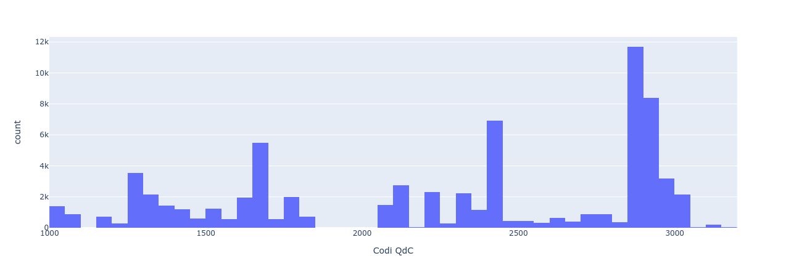

The [Archival Datathon](https://www.kaggle.com/c/archivalDatathon) is in Kaggle and asks to solve a text classification task.

## Problem statement

Data comes from municipal archives of several towns in Catalunya.

Training data is given in a `train.csv` file containing two columns:

- `TÍTOL (str)`, a short sentence describing the title of the document, as registered in the archive. This is the document that we process.
- `Codi QdC (int)`, the target label.

The problem is to train a multiclassifier on the documents to predict the target label. The scoring metric is the __Mean F1-score__, which (after checking) is equal to the `f1_score` from [[scikit-learn]] with `average="micro"`.

There is a second file, `test.csv`, containing:
- `ID (int)` as an identifier for the document.
- `TÍTOL (str)` the document to classify.

In order to submit a prediction, it is necessary to prepare a csv file containing:
- `ID (int)` as above.
- `Codi QdC (int)` for the prediction of the document with this `ID`.

This is scored by Kaggle; validation against 30% of the test data is shown in the public leaderboard and the rest is stored privately in the competition.
 
There is no limit to the number of submissions.

Finally, there is a third file, `categories.csv`, containing:
- `Codi QdC (int)`.
- `Títol de entrada del catàleg (str)`; the name of the classification entry corresponding to this code identifier.

## Dataset explo

The training dataset contains 71839 samples. The test dataset contains 17960 samples.

### Documents

The documents in the training dataset are in Catalan. They are short and contain many, many mistakes. They look pretty much like OCR scans of handwritten texts.

The average length in characters is 52, following the distribution below.

### Classification ID

The target label. This is an integer ranging from 1001 to 3155 with 1988 possible values, out of which 341 are present in the training dataset.

Despite being integers, we do not see a reason not to treat them as pure labels because the F1 score will not reinforce small approximation errors in learning.

Some classes are way heavier than others. In some sense, we need to predict this distribution:

### Classification ID tags

We could use the information in the descriptions in `categories.csv`.

## Training

## Scoring

F1 with micro average coincides with the accuracy metric in sklearn. This is the main target to optimize.

We also keep track of the F1 score with macro average, which yields a far worse value.

Confusion matrices, ROC curves and AUROC metrics are not so-well suited when there are so many classes to predict.

## Ideas to test

Attempt a topic modelling approach based on the category descriptions in `categories.csv`.

## Discarded ideas