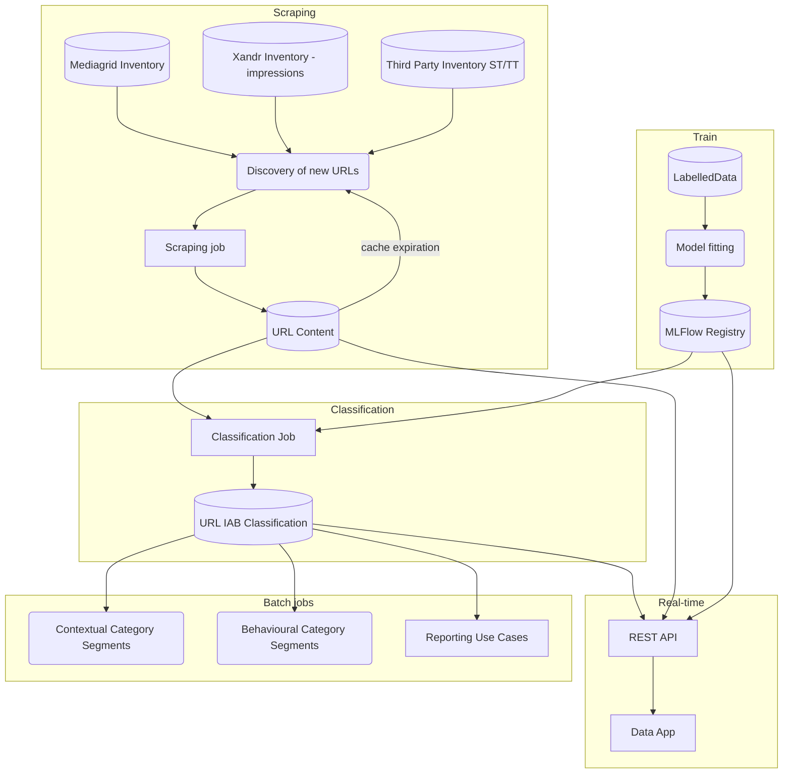

This evergreen note will document a plan to deliver a IAB classification of URLs and domains at volume.

There are three distinct problems:

1. Training an NLP model capable of classifying IAB URLs.
2. Retrieving the contents of large quantities of URLs, aka __The Scraping Problem__
3. Using the NLP model to classify URL contents.
4. Serving the model in real-time for people to be able to interact with it.

